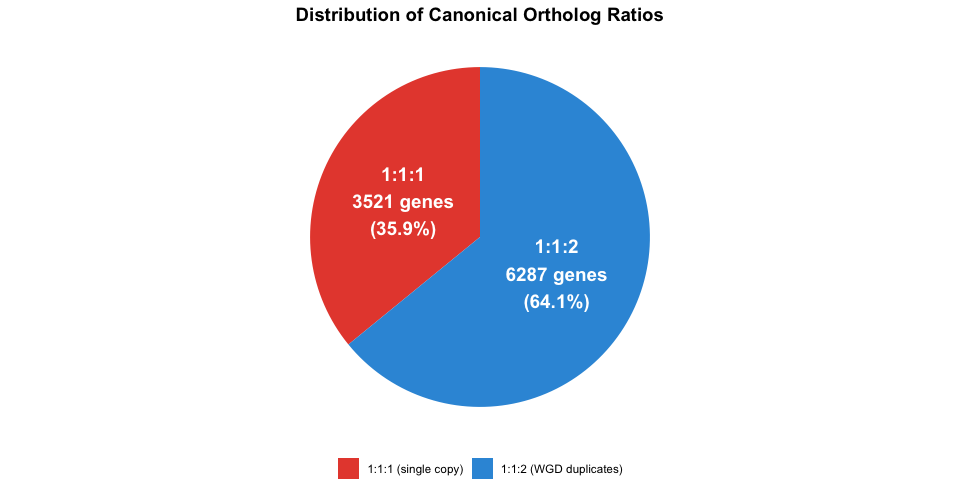
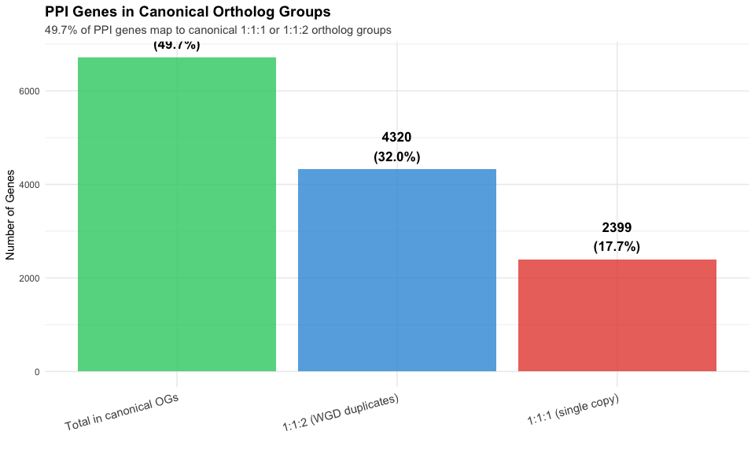
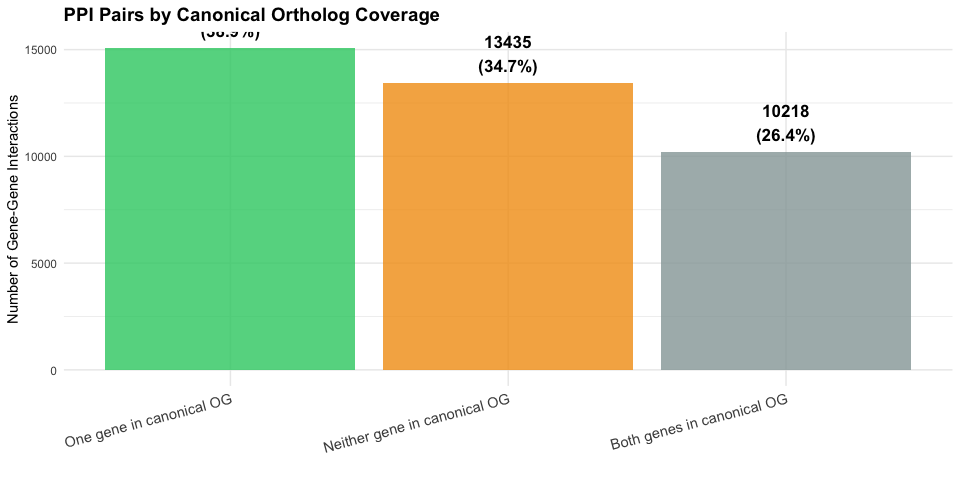
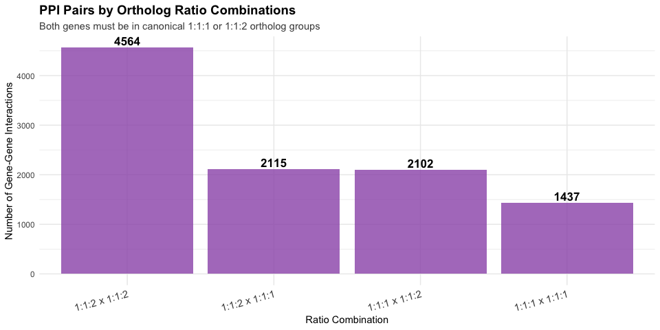

Protein-Protein Interaction Ortholog Mapping Report
================
PPI-SalmoDup Project
2026-01-12

# Executive Summary

This report analyzes the mapping of human protein-protein interaction
(PPI) data to orthologs in pike (*Esox lucius*) and salmon (*Salmo
salar*) **at the gene level**. The goal is to identify which human PPI
genes have conserved orthologs in fish species to study the evolution of
protein interactions following salmon’s whole-genome duplication (WGD).

**Key Findings:** - **13,520 unique genes** participate in 38,729
gene-gene interactions in the PPI dataset - **49.7%** of PPI genes
(6,719 out of 13,520) map to **canonical ortholog groups** - 32.0% in
1:1:2 ratio (one human, one pike, two salmon - WGD duplicates) - 17.7%
in 1:1:1 ratio (one human, one pike, one salmon - single copy) -
**26.4%** of PPI pairs (10,218 out of 38,729) have **both genes in
canonical OGs** - Remaining genes either lack fish orthologs
(mammalian-specific) or have complex orthology patterns

------------------------------------------------------------------------

# Data Loading

``` r
# Load required libraries
library(ggplot2)
library(dplyr)
library(tidyr)
library(knitr)
library(stringr)

# Load gene-level PPI data
gene_ppi <- read.table(
    "gene_level_ppi.tsv",
    header = TRUE,
    sep = "\t",
    stringsAsFactors = FALSE
)

# Load canonical ortholog genes
canonical_genes <- read.table(
    "canonical_ortholog_genes.tsv",
    header = TRUE,
    sep = "\t",
    stringsAsFactors = FALSE
)

# Load canonical PPI pairs
gene_ppi_canonical <- read.table(
    "gene_level_ppi_canonical.tsv",
    header = TRUE,
    sep = "\t",
    stringsAsFactors = FALSE
)

# Load full ortholog mapping for additional analysis
ortho_mapping <- read.table(
    "uniprot_to_orthologs_mapping_N0.tsv",
    header = TRUE,
    sep = "\t",
    stringsAsFactors = FALSE
)

# Get unique genes
unique_genes <- unique(c(gene_ppi$geneA, gene_ppi$geneB))
n_total_genes <- length(unique_genes)
n_total_pairs <- nrow(gene_ppi)
```

------------------------------------------------------------------------

# Gene-Level PPI Dataset

## Why Gene-Level Analysis?

The original PPI dataset uses UniProt IDs, which can represent
**multiple protein isoforms** from the same gene. Since ortholog mapping
is gene-based (not isoform-based), we collapsed the data to gene level:

- **Gene-gene interaction exists** if any protein isoform pair between
  the two genes interacts
- Eliminates double-counting of interactions due to alternative splicing

``` r
summary_stats <- data.frame(
  Metric = c("Total gene-gene interactions",
             "Total unique genes in PPI"),
  Count = c(n_total_pairs, n_total_genes)
)

kable(summary_stats,
      caption = "Gene-Level PPI Dataset Summary",
      col.names = c("Metric", "Count"))
```

| Metric                       | Count |
|:-----------------------------|------:|
| Total gene-gene interactions | 38729 |
| Total unique genes in PPI    | 13520 |

Gene-Level PPI Dataset Summary

------------------------------------------------------------------------

# Canonical Ortholog Ratios

We focus on **canonical ortholog ratios** that are most informative for
studying WGD:

- **1:1:2 (Hsap:Eluc:Ssal)**: One human gene, one pike gene, two salmon
  genes
  - **Expected WGD pattern** - salmon retained both duplicates
- **1:1:1 (Hsap:Eluc:Ssal)**: One human gene, one pike gene, one salmon
  gene
  - **Single-copy retained** - salmon lost one duplicate
    (rediploidization)

These exclude: - Ancient duplications (pre-dating human-fish split) -
Complex orthology patterns (e.g., 2:2:4, 1:2:3) - Lineage-specific
losses or duplications

``` r
canonical_summary <- canonical_genes %>%
  group_by(ratio) %>%
  summarise(n_genes = n(), .groups = "drop") %>%
  mutate(percentage = 100 * n_genes / sum(n_genes))

kable(canonical_summary,
      digits = 1,
      caption = "Canonical Ortholog Ratio Distribution",
      col.names = c("Ratio (Hsap:Eluc:Ssal)", "Number of Genes", "Percentage (%)"))
```

| Ratio (Hsap:Eluc:Ssal) | Number of Genes | Percentage (%) |
|:-----------------------|----------------:|---------------:|
| 1:1:1                  |            3521 |           35.9 |
| 1:1:2                  |            6287 |           64.1 |

Canonical Ortholog Ratio Distribution

``` r
ggplot(canonical_summary, aes(x = "", y = n_genes, fill = ratio)) +
  geom_bar(stat = "identity", width = 1) +
  coord_polar("y", start = 0) +
  geom_text(aes(label = sprintf("%s\n%d genes\n(%.1f%%)", ratio, n_genes, percentage)),
            position = position_stack(vjust = 0.5),
            size = 5,
            color = "white",
            fontface = "bold") +
  scale_fill_manual(values = c("1:1:1" = "#e74c3c", "1:1:2" = "#3498db"),
                    labels = c("1:1:1 (single copy)", "1:1:2 (WGD duplicates)")) +
  theme_void() +
  theme(legend.position = "bottom",
        legend.title = element_blank(),
        plot.title = element_text(hjust = 0.5, size = 14, face = "bold")) +
  labs(title = "Distribution of Canonical Ortholog Ratios")
```

<!-- -->

**Interpretation:** 64% of canonical orthologs show the 1:1:2 pattern,
consistent with salmon WGD where both duplicates were retained.

------------------------------------------------------------------------

# PPI Genes in Canonical Ortholog Groups

``` r
ppi_genes_in_canonical <- unique_genes[unique_genes %in% canonical_genes$human_ensembl]

ppi_canonical_breakdown <- data.frame(
  Category = c("1:1:2 (WGD duplicates)",
               "1:1:1 (single copy)",
               "Total in canonical OGs",
               "Not in canonical OGs",
               "Total PPI genes"),
  Count = c(
    sum(unique_genes %in% (canonical_genes %>% filter(ratio == "1:1:2") %>% pull(human_ensembl))),
    sum(unique_genes %in% (canonical_genes %>% filter(ratio == "1:1:1") %>% pull(human_ensembl))),
    length(ppi_genes_in_canonical),
    n_total_genes - length(ppi_genes_in_canonical),
    n_total_genes
  )
)
ppi_canonical_breakdown$Percentage <- 100 * ppi_canonical_breakdown$Count / n_total_genes

kable(ppi_canonical_breakdown,
      digits = 1,
      caption = "PPI Genes by Canonical Ortholog Status",
      col.names = c("Category", "Count", "Percentage (%)"))
```

| Category               | Count | Percentage (%) |
|:-----------------------|------:|---------------:|
| 1:1:2 (WGD duplicates) |  4320 |           32.0 |
| 1:1:1 (single copy)    |  2399 |           17.7 |
| Total in canonical OGs |  6719 |           49.7 |
| Not in canonical OGs   |  6801 |           50.3 |
| Total PPI genes        | 13520 |          100.0 |

PPI Genes by Canonical Ortholog Status

``` r
plot_data <- ppi_canonical_breakdown[1:3, ]

ggplot(plot_data, aes(x = reorder(Category, -Count), y = Count)) +
  geom_bar(stat = "identity", fill = c("#3498db", "#e74c3c", "#2ecc71"), alpha = 0.8) +
  geom_text(aes(label = sprintf("%d\n(%.1f%%)", Count, Percentage)),
            vjust = -0.3, size = 4.5, fontface = "bold") +
  labs(title = "PPI Genes in Canonical Ortholog Groups",
       subtitle = sprintf("%.1f%% of PPI genes map to canonical 1:1:1 or 1:1:2 ortholog groups",
                         100 * length(ppi_genes_in_canonical) / n_total_genes),
       x = "",
       y = "Number of Genes") +
  theme_minimal() +
  theme(axis.text.x = element_text(angle = 15, hjust = 1, size = 11),
        plot.title = element_text(size = 14, face = "bold"),
        plot.subtitle = element_text(size = 11, color = "gray30"))
```

<!-- -->

------------------------------------------------------------------------

# PPI Pairs with Both Genes in Canonical OGs

For comparative analysis of PPI evolution, we focus on **gene pairs
where BOTH genes are in canonical ortholog groups**.

``` r
# Add ratio information to gene pairs
gene_ppi_with_ratios <- gene_ppi %>%
  left_join(canonical_genes %>% select(human_ensembl, ratioA = ratio),
            by = c("geneA" = "human_ensembl")) %>%
  left_join(canonical_genes %>% select(human_ensembl, ratioB = ratio),
            by = c("geneB" = "human_ensembl")) %>%
  mutate(
    both_canonical = !is.na(ratioA) & !is.na(ratioB),
    pair_type = case_when(
      is.na(ratioA) & is.na(ratioB) ~ "Neither gene in canonical OG",
      is.na(ratioA) | is.na(ratioB) ~ "One gene in canonical OG",
      TRUE ~ "Both genes in canonical OG"
    )
  )

pair_summary <- gene_ppi_with_ratios %>%
  group_by(pair_type) %>%
  summarise(n_pairs = n(), .groups = "drop") %>%
  mutate(percentage = 100 * n_pairs / sum(n_pairs)) %>%
  arrange(desc(n_pairs))

kable(pair_summary,
      digits = 1,
      caption = "PPI Pairs by Canonical Ortholog Status",
      col.names = c("Pair Type", "Number of Pairs", "Percentage (%)"))
```

| Pair Type                    | Number of Pairs | Percentage (%) |
|:-----------------------------|----------------:|---------------:|
| One gene in canonical OG     |           15076 |           38.9 |
| Neither gene in canonical OG |           13435 |           34.7 |
| Both genes in canonical OG   |           10218 |           26.4 |

PPI Pairs by Canonical Ortholog Status

``` r
ggplot(pair_summary, aes(x = reorder(pair_type, -n_pairs), y = n_pairs)) +
  geom_bar(stat = "identity", fill = c("#2ecc71", "#f39c12", "#95a5a6"), alpha = 0.8) +
  geom_text(aes(label = sprintf("%d\n(%.1f%%)", n_pairs, percentage)),
            vjust = -0.3, size = 4.5, fontface = "bold") +
  labs(title = "PPI Pairs by Canonical Ortholog Coverage",
       x = "",
       y = "Number of Gene-Gene Interactions") +
  theme_minimal() +
  theme(axis.text.x = element_text(angle = 15, hjust = 1, size = 11),
        plot.title = element_text(size = 14, face = "bold"))
```

<!-- -->

## Breakdown by Ratio Combinations

``` r
ratio_combinations <- gene_ppi_with_ratios %>%
  filter(both_canonical) %>%
  group_by(ratioA, ratioB) %>%
  summarise(n_pairs = n(), .groups = "drop") %>%
  arrange(desc(n_pairs))

kable(ratio_combinations,
      caption = "PPI Pairs by Ortholog Ratio Combinations (Both Genes in Canonical OGs)",
      col.names = c("Gene A Ratio", "Gene B Ratio", "Number of Pairs"))
```

| Gene A Ratio | Gene B Ratio | Number of Pairs |
|:-------------|:-------------|----------------:|
| 1:1:2        | 1:1:2        |            4564 |
| 1:1:2        | 1:1:1        |            2115 |
| 1:1:1        | 1:1:2        |            2102 |
| 1:1:1        | 1:1:1        |            1437 |

PPI Pairs by Ortholog Ratio Combinations (Both Genes in Canonical OGs)

``` r
# Create combination labels
ratio_combinations <- ratio_combinations %>%
  mutate(combo = paste(ratioA, "x", ratioB))

ggplot(ratio_combinations, aes(x = reorder(combo, -n_pairs), y = n_pairs)) +
  geom_bar(stat = "identity", fill = "#9b59b6", alpha = 0.8) +
  geom_text(aes(label = n_pairs), vjust = -0.3, size = 4.5, fontface = "bold") +
  labs(title = "PPI Pairs by Ortholog Ratio Combinations",
       subtitle = "Both genes must be in canonical 1:1:1 or 1:1:2 ortholog groups",
       x = "Ratio Combination",
       y = "Number of Gene-Gene Interactions") +
  theme_minimal() +
  theme(axis.text.x = element_text(angle = 15, hjust = 1, size = 11),
        plot.title = element_text(size = 14, face = "bold"),
        plot.subtitle = element_text(size = 11, color = "gray30"))
```

<!-- -->

**Key Observations:** - **4,564 pairs** are between two 1:1:2 genes
(both WGD duplicates) - **4,217 pairs** are between 1:1:2 and 1:1:1
genes (mixed) - **1,437 pairs** are between two 1:1:1 genes (both
single-copy)

## Canonical Ortholog Groups with PPI Partners

This section generates a comprehensive table of all canonical ortholog
groups (1:1:1 and 1:1:2) where the human gene has at least one PPI
partner.

``` r
# Load original PPI data (skip comment lines)
ppi_raw <- read.table(
  "final_predictions/final_predictions_80.tsv",
  header = TRUE,
  sep = "\t",
  skip = 28,
  stringsAsFactors = FALSE,
  quote = ""
)

# Get all UniProt IDs and gene names from PPI data
ppi_proteins_info <- bind_rows(
  ppi_raw %>% select(uniprot_id = Protein1, gene_name = Name1),
  ppi_raw %>% select(uniprot_id = Protein2, gene_name = Name2)
) %>%
  distinct()

# Load UniProt to Ensembl mapping
uniprot_map <- read.table(
  "uniprot_to_ensembl_human.tsv",
  header = TRUE,
  sep = "\t",
  stringsAsFactors = FALSE
)

# Get all human genes that appear in canonical PPI pairs
genes_with_ppi <- unique(c(gene_ppi_canonical$geneA, gene_ppi_canonical$geneB))

# Get list of PPI partners for each gene
ppi_partner_lists <- bind_rows(
  gene_ppi_canonical %>% select(gene = geneA, partner = geneB),
  gene_ppi_canonical %>% select(gene = geneB, partner = geneA)
) %>%
  group_by(gene) %>%
  summarise(interacting_genes = paste(sort(unique(partner)), collapse = ","), .groups = "drop")

# Map genes to their UniProt IDs (only those in PPI data) and gene names
gene_to_info <- uniprot_map %>%
  left_join(ppi_proteins_info, by = "uniprot_id") %>%
  filter(!is.na(gene_name)) %>%  # Only keep proteins from PPI data
  select(ensembl_gene_id, uniprot_id, gene_name) %>%
  distinct() %>%
  group_by(ensembl_gene_id) %>%
  summarise(
    human_protein_ids = paste(sort(unique(uniprot_id)), collapse = ","),
    gene_name = paste(unique(gene_name), collapse = ","),
    .groups = "drop"
  )

# Create the canonical ortholog table with PPI partners
canonical_ppi_table <- canonical_genes %>%
  filter(human_ensembl %in% genes_with_ppi) %>%
  left_join(gene_to_info, by = c("human_ensembl" = "ensembl_gene_id")) %>%
  left_join(ppi_partner_lists, by = c("human_ensembl" = "gene")) %>%
  # Sort by number of partners
  mutate(n_partners = str_count(interacting_genes, ",") + 1) %>%
  arrange(desc(n_partners), ratio, human_ensembl) %>%
  select(gene_name, human_gene_id = human_ensembl, human_protein_ids,
         OG_N0 = ortholog_group_N0, pike_gene_id = pike_genes,
         salmon_gene_id = salmon_genes, ratio, interacting_genes)

# Save the table as TSV
write.table(canonical_ppi_table,
            file = "canonical_orthologs_with_ppi.tsv",
            sep = "\t",
            row.names = FALSE,
            quote = FALSE)

# Display summary statistics
cat(sprintf("\n**Table saved to: canonical_orthologs_with_ppi.tsv**\n\n"))
```

    ## 
    ## **Table saved to: canonical_orthologs_with_ppi.tsv**

``` r
cat(sprintf("Total canonical genes with PPI partners: %d\n", nrow(canonical_ppi_table)))
```

    ## Total canonical genes with PPI partners: 5847

``` r
cat(sprintf("- 1:1:2 genes: %d\n", sum(canonical_ppi_table$ratio == "1:1:2")))
```

    ## - 1:1:2 genes: 3767

``` r
cat(sprintf("- 1:1:1 genes: %d\n\n", sum(canonical_ppi_table$ratio == "1:1:1")))
```

    ## - 1:1:1 genes: 2080

``` r
# Display sample (top 20 rows)
cat("**Sample of the table (top 20 genes by number of PPI partners):**\n\n")
```

    ## **Sample of the table (top 20 genes by number of PPI partners):**

``` r
kable(head(canonical_ppi_table, 20),
      caption = "Top 20 genes by number of PPI partners (full table in canonical_orthologs_with_ppi.tsv)")
```

| gene_name | human_gene_id | human_protein_ids | OG_N0 | pike_gene_id | salmon_gene_id | ratio | interacting_genes |
|:---|:---|:---|:---|:---|:---|:---|:---|
| EGFR | ENSG00000146648 | P00533 | OG6v0001342.53 | ENSELUG00000024112 | ENSSSAG00000067891,ENSSSAG00000003786 | 1:1:2 | ENSG00000003056,ENSG00000005961,ENSG00000020129,ENSG00000027001,ENSG00000044115,ENSG00000047249,ENSG00000059691,ENSG00000071537,ENSG00000073536,ENSG00000073614,ENSG00000074266,ENSG00000076513,ENSG00000078061,ENSG00000085832,ENSG00000100485,ENSG00000100532,ENSG00000101019,ENSG00000101311,ENSG00000103168,ENSG00000104369,ENSG00000108963,ENSG00000111252,ENSG00000111845,ENSG00000115085,ENSG00000115904,ENSG00000123130,ENSG00000124882,ENSG00000127946,ENSG00000128833,ENSG00000130177,ENSG00000130402,ENSG00000131725,ENSG00000134109,ENSG00000134516,ENSG00000136158,ENSG00000136504,ENSG00000137055,ENSG00000138231,ENSG00000138592,ENSG00000138798,ENSG00000139263,ENSG00000140575,ENSG00000144749,ENSG00000145623,ENSG00000150093,ENSG00000154473,ENSG00000154485,ENSG00000154734,ENSG00000155858,ENSG00000157881,ENSG00000158092,ENSG00000160255,ENSG00000160293,ENSG00000162434,ENSG00000163638,ENSG00000163697,ENSG00000164654,ENSG00000167965,ENSG00000168036,ENSG00000172409,ENSG00000173801,ENSG00000183918,ENSG00000196305,ENSG00000196396,ENSG00000196455,ENSG00000197601,ENSG00000198087,ENSG00000198730,ENSG00000204560,ENSG00000204950,ENSG00000242028,ENSG00000274523 |
| SQSTM1 | ENSG00000161011 | Q13501 | OG6v0007465.29 | ENSELUG00000021590 | ENSSSAG00000073443,ENSSSAG00000076115 | 1:1:2 | ENSG00000006282,ENSG00000023287,ENSG00000034693,ENSG00000034713,ENSG00000061938,ENSG00000067606,ENSG00000079999,ENSG00000084754,ENSG00000101255,ENSG00000104365,ENSG00000105053,ENSG00000106617,ENSG00000113851,ENSG00000116698,ENSG00000130305,ENSG00000130766,ENSG00000132017,ENSG00000134109,ENSG00000136542,ENSG00000136807,ENSG00000137764,ENSG00000146021,ENSG00000159131,ENSG00000162063,ENSG00000163389,ENSG00000163558,ENSG00000169967,ENSG00000172046,ENSG00000172175,ENSG00000183508,ENSG00000197157,ENSG00000198909,ENSG00000198929,ENSG00000213585 |
| TCF4 | ENSG00000196628 | P15884 | OG6v0007056.28 | ENSELUG00000015197 | ENSSSAG00000113835,ENSSSAG00000071044 | 1:1:2 | ENSG00000059728,ENSG00000105698,ENSG00000105967,ENSG00000113196,ENSG00000115738,ENSG00000117318,ENSG00000118526,ENSG00000122180,ENSG00000122859,ENSG00000123307,ENSG00000123933,ENSG00000139352,ENSG00000146618,ENSG00000151379,ENSG00000162367,ENSG00000163792,ENSG00000164107,ENSG00000164600,ENSG00000168267,ENSG00000168874,ENSG00000171532,ENSG00000172201,ENSG00000172238,ENSG00000173801,ENSG00000178860,ENSG00000180535,ENSG00000181965,ENSG00000183733,ENSG00000184162,ENSG00000186051,ENSG00000213347,ENSG00000233608,ENSG00000260428,ENSG00000261787 |
| CCNF | ENSG00000162063 | P41002 | OG6v0008566.27 | ENSELUG00000000550 | ENSSSAG00000038367,ENSSSAG00000047410 | 1:1:2 | ENSG00000006607,ENSG00000058272,ENSG00000065000,ENSG00000070018,ENSG00000077514,ENSG00000100888,ENSG00000103540,ENSG00000106211,ENSG00000108588,ENSG00000110075,ENSG00000111276,ENSG00000116830,ENSG00000121152,ENSG00000124789,ENSG00000125459,ENSG00000131269,ENSG00000134014,ENSG00000141456,ENSG00000143569,ENSG00000143702,ENSG00000156650,ENSG00000159267,ENSG00000160688,ENSG00000161011,ENSG00000162813,ENSG00000163110,ENSG00000168256,ENSG00000170860,ENSG00000177425,ENSG00000185728,ENSG00000187634,ENSG00000196504,ENSG00000204574 |
| SEC61B | ENSG00000106803 | P60468 | OG6v0009561.27 | ENSELUG00000008775 | ENSSSAG00000003446,ENSSSAG00000038744 | 1:1:2 | ENSG00000008952,ENSG00000025796,ENSG00000059769,ENSG00000084073,ENSG00000087111,ENSG00000101856,ENSG00000105677,ENSG00000125912,ENSG00000126777,ENSG00000127022,ENSG00000127184,ENSG00000129636,ENSG00000134109,ENSG00000134910,ENSG00000136770,ENSG00000143183,ENSG00000145354,ENSG00000150093,ENSG00000156642,ENSG00000158669,ENSG00000162236,ENSG00000164180,ENSG00000166479,ENSG00000168818,ENSG00000169446,ENSG00000172270,ENSG00000174106,ENSG00000180879,ENSG00000228474,ENSG00000265808 |
| CDC5L | ENSG00000096401 | Q99459 | OG6v0004438.35 | ENSELUG00000013492 | ENSSSAG00000002525,ENSSSAG00000005830 | 1:1:2 | ENSG00000018610,ENSG00000060688,ENSG00000076924,ENSG00000082068,ENSG00000091732,ENSG00000099995,ENSG00000100056,ENSG00000100603,ENSG00000101161,ENSG00000101343,ENSG00000105248,ENSG00000114346,ENSG00000116752,ENSG00000117614,ENSG00000117751,ENSG00000127993,ENSG00000138398,ENSG00000140259,ENSG00000140829,ENSG00000143751,ENSG00000163510,ENSG00000163605,ENSG00000163877,ENSG00000164609,ENSG00000165934,ENSG00000168438,ENSG00000171566,ENSG00000174780,ENSG00000204560 |
| MED1 | ENSG00000125686 | Q15648 | OG6v0013851.21 | ENSELUG00000006631 | ENSSSAG00000046248 | 1:1:1 | ENSG00000008838,ENSG00000025434,ENSG00000073536,ENSG00000084754,ENSG00000101076,ENSG00000108590,ENSG00000109670,ENSG00000109819,ENSG00000112033,ENSG00000112237,ENSG00000113580,ENSG00000115216,ENSG00000132170,ENSG00000134480,ENSG00000136146,ENSG00000136807,ENSG00000136878,ENSG00000137947,ENSG00000140396,ENSG00000147044,ENSG00000151090,ENSG00000163659,ENSG00000164749,ENSG00000167258,ENSG00000186951,ENSG00000188487,ENSG00000196482,ENSG00000198677 |
| KDM1A | ENSG00000004487 | O60341 | OG6v0006788.28 | ENSELUG00000014749 | ENSSSAG00000008598,ENSSSAG00000002472 | 1:1:2 | ENSG00000012048,ENSG00000058272,ENSG00000071243,ENSG00000083093,ENSG00000101412,ENSG00000105991,ENSG00000109787,ENSG00000111707,ENSG00000112333,ENSG00000116731,ENSG00000117625,ENSG00000122565,ENSG00000142611,ENSG00000148516,ENSG00000149179,ENSG00000156650,ENSG00000156802,ENSG00000162367,ENSG00000163666,ENSG00000163935,ENSG00000166477,ENSG00000167771,ENSG00000169375,ENSG00000169554,ENSG00000169758,ENSG00000169925,ENSG00000175595,ENSG00000196220 |
| CDK9 | ENSG00000136807 | P50750 | OG6v0015343.20 | ENSELUG00000019692 | ENSSSAG00000070738 | 1:1:1 | ENSG00000082258,ENSG00000088930,ENSG00000090061,ENSG00000100813,ENSG00000110713,ENSG00000113558,ENSG00000114942,ENSG00000125686,ENSG00000128915,ENSG00000129315,ENSG00000134058,ENSG00000137815,ENSG00000144597,ENSG00000157212,ENSG00000161011,ENSG00000163872,ENSG00000166477,ENSG00000166986,ENSG00000167513,ENSG00000171843,ENSG00000172493,ENSG00000187735,ENSG00000188739,ENSG00000197555,ENSG00000197780,ENSG00000254772 |
| CTNNB1 | ENSG00000168036 | P35222 | OG6v0004436.35 | ENSELUG00000001202 | ENSSSAG00000108396,ENSSSAG00000091484 | 1:1:2 | ENSG00000044115,ENSG00000066032,ENSG00000081138,ENSG00000118689,ENSG00000129910,ENSG00000133961,ENSG00000134371,ENSG00000137693,ENSG00000140937,ENSG00000146648,ENSG00000149654,ENSG00000152104,ENSG00000152284,ENSG00000154162,ENSG00000165731,ENSG00000168646,ENSG00000170558,ENSG00000172977,ENSG00000173801,ENSG00000179242,ENSG00000184481,ENSG00000185591,ENSG00000187098,ENSG00000196781,ENSG00000197555,ENSG00000198728 |
| BUB1B | ENSG00000156970 | O60566 | OG6v0004175.61 | ENSELUG00000016511 | ENSSSAG00000047958 | 1:1:1 | ENSG00000011295,ENSG00000032742,ENSG00000089053,ENSG00000094880,ENSG00000117399,ENSG00000117650,ENSG00000122912,ENSG00000130177,ENSG00000136098,ENSG00000137812,ENSG00000143643,ENSG00000143924,ENSG00000144535,ENSG00000145386,ENSG00000154473,ENSG00000164109,ENSG00000164287,ENSG00000166851,ENSG00000167842,ENSG00000169679,ENSG00000170312,ENSG00000171720,ENSG00000177602,ENSG00000185515,ENSG00000213337 |
| CDC16 | ENSG00000130177 | Q13042 | OG6v0007175.28 | ENSELUG00000011142 | ENSSSAG00000065343,ENSSSAG00000044519 | 1:1:2 | ENSG00000012048,ENSG00000058091,ENSG00000073282,ENSG00000085511,ENSG00000089159,ENSG00000094880,ENSG00000107560,ENSG00000110200,ENSG00000114805,ENSG00000116698,ENSG00000117650,ENSG00000135913,ENSG00000139687,ENSG00000141027,ENSG00000141570,ENSG00000146648,ENSG00000156970,ENSG00000157212,ENSG00000173894,ENSG00000176386,ENSG00000178053,ENSG00000184708,ENSG00000185002,ENSG00000196510,ENSG00000197323 |
| OGT | ENSG00000147162 | O15294 | OG6v0008368.27 | ENSELUG00000004547 | ENSSSAG00000063890,ENSSSAG00000061261 | 1:1:2 | ENSG00000056586,ENSG00000067369,ENSG00000071243,ENSG00000080824,ENSG00000100084,ENSG00000100284,ENSG00000101966,ENSG00000108061,ENSG00000111011,ENSG00000114982,ENSG00000118900,ENSG00000136279,ENSG00000141568,ENSG00000153015,ENSG00000163875,ENSG00000163930,ENSG00000168286,ENSG00000168495,ENSG00000171456,ENSG00000173744,ENSG00000178028,ENSG00000185591,ENSG00000187605,ENSG00000187778,ENSG00000254772 |
| ITGB1 | ENSG00000150093 | P05556 | OG6v0000861.61 | ENSELUG00000003788 | ENSSSAG00000080301,ENSSSAG00000039442 | 1:1:2 | ENSG00000005884,ENSG00000005961,ENSG00000073712,ENSG00000077943,ENSG00000091409,ENSG00000101311,ENSG00000106803,ENSG00000110900,ENSG00000112769,ENSG00000113140,ENSG00000115232,ENSG00000135424,ENSG00000136068,ENSG00000137076,ENSG00000138448,ENSG00000144668,ENSG00000146648,ENSG00000151490,ENSG00000154721,ENSG00000172270,ENSG00000173402,ENSG00000177697,ENSG00000196396,ENSG00000196924,ENSG00000197467 |
| UBE2D4 | ENSG00000078967 | Q9Y2X8 | OG6v0000133.237 | ENSELUG00000028298 | ENSSSAG00000088616,ENSSSAG00000073416 | 1:1:2 | ENSG00000011275,ENSG00000013561,ENSG00000063978,ENSG00000072609,ENSG00000075975,ENSG00000082996,ENSG00000091073,ENSG00000108523,ENSG00000113269,ENSG00000113558,ENSG00000135144,ENSG00000138942,ENSG00000141622,ENSG00000159461,ENSG00000167770,ENSG00000168894,ENSG00000172354,ENSG00000173926,ENSG00000178498,ENSG00000185345,ENSG00000186187,ENSG00000204227,ENSG00000204308,ENSG00000265491 |
| VAMP4 | ENSG00000117533 | O75379 | OG6v0009431.27 | ENSELUG00000007067 | ENSSSAG00000054312,ENSSSAG00000054845 | 1:1:2 | ENSG00000003056,ENSG00000076944,ENSG00000092108,ENSG00000092531,ENSG00000099365,ENSG00000099940,ENSG00000100568,ENSG00000105518,ENSG00000105829,ENSG00000113734,ENSG00000116266,ENSG00000118640,ENSG00000124098,ENSG00000132639,ENSG00000136631,ENSG00000136854,ENSG00000141699,ENSG00000143952,ENSG00000147654,ENSG00000148335,ENSG00000148344,ENSG00000167306,ENSG00000168818,ENSG00000170310 |
| TLN1 | ENSG00000137076 | Q9Y490 | OG6v0000614.72 | ENSELUG00000017099 | ENSSSAG00000063331 | 1:1:1 | ENSG00000005961,ENSG00000073712,ENSG00000077420,ENSG00000079308,ENSG00000082781,ENSG00000089159,ENSG00000095637,ENSG00000120896,ENSG00000135424,ENSG00000136068,ENSG00000140575,ENSG00000140682,ENSG00000141452,ENSG00000148180,ENSG00000148484,ENSG00000150093,ENSG00000164741,ENSG00000166886,ENSG00000169398,ENSG00000173166,ENSG00000180353,ENSG00000186994,ENSG00000197256 |
| CTR9 | ENSG00000198730 | Q6PD62 | OG6v0006565.28 | ENSELUG00000015852 | ENSSSAG00000072773,ENSSSAG00000068129 | 1:1:2 | ENSG00000006712,ENSG00000047410,ENSG00000072364,ENSG00000128915,ENSG00000134371,ENSG00000135241,ENSG00000137815,ENSG00000139842,ENSG00000140395,ENSG00000141568,ENSG00000143614,ENSG00000144597,ENSG00000146648,ENSG00000156802,ENSG00000166477,ENSG00000171843,ENSG00000172493,ENSG00000174469,ENSG00000177700,ENSG00000179262,ENSG00000187735,ENSG00000196235,ENSG00000204356 |
| SIN3A | ENSG00000169375 | Q96ST3 | OG6v0003316.43 | ENSELUG00000023525 | ENSSSAG00000044150 | 1:1:1 | ENSG00000004487,ENSG00000070444,ENSG00000071243,ENSG00000100281,ENSG00000100916,ENSG00000102054,ENSG00000105856,ENSG00000106290,ENSG00000109118,ENSG00000111707,ENSG00000112511,ENSG00000118482,ENSG00000133895,ENSG00000138433,ENSG00000141027,ENSG00000141568,ENSG00000146414,ENSG00000163110,ENSG00000164576,ENSG00000174744,ENSG00000185591,ENSG00000196591 |
| ACE2 | ENSG00000130234 | Q9BYF1 | OG6v0012567.23 | ENSELUG00000011793 | ENSSSAG00000122237,ENSSSAG00000067757 | 1:1:2 | ENSG00000047410,ENSG00000056097,ENSG00000065978,ENSG00000070159,ENSG00000072274,ENSG00000086015,ENSG00000099250,ENSG00000106554,ENSG00000107164,ENSG00000110075,ENSG00000113758,ENSG00000118689,ENSG00000124789,ENSG00000126261,ENSG00000134352,ENSG00000135387,ENSG00000135679,ENSG00000154639,ENSG00000163817,ENSG00000177663,ENSG00000179776,ENSG00000277443 |

Top 20 genes by number of PPI partners (full table in
canonical_orthologs_with_ppi.tsv)

**Table columns:** - **gene_name**: Human gene name (e.g., EGFR,
SQSTM1) - **human_gene_id**: Human Ensembl gene ID -
**human_protein_ids**: UniProt protein IDs that appear in the PPI
dataset (comma-separated) - **OG_N0**: N0-level ortholog group
identifier - **pike_gene_id**: Pike ortholog gene ID(s) -
**salmon_gene_id**: Salmon ortholog gene ID(s) - comma-separated for
duplicates - **ratio**: Ortholog ratio (1:1:1 or 1:1:2) -
**interacting_genes**: Comma-separated list of all human gene IDs that
interact with this gene

**How to use this table:** - **For 1:1:2 orthologs**: Compare pike gene
→ salmon duplicate A and duplicate B - **For 1:1:1 orthologs**: Compare
pike gene → salmon single-copy gene - **Salmon gene pairs**
(comma-separated in 1:1:2) represent WGD duplicates to test for PPI
subfunctionalization

------------------------------------------------------------------------

# Why Aren’t All Genes in Canonical OGs?

``` r
# Analyze genes NOT in canonical OGs
non_canonical_genes <- unique_genes[!unique_genes %in% canonical_genes$human_ensembl]

# Check if they're in ortholog mapping at all
genes_with_orthologs <- unique(ortho_mapping$human_ensembl)
non_canonical_with_orthologs <- non_canonical_genes[non_canonical_genes %in% genes_with_orthologs]
non_canonical_no_orthologs <- non_canonical_genes[!non_canonical_genes %in% genes_with_orthologs]

reasons <- data.frame(
  Reason = c("No fish orthologs (mammalian-specific)",
             "Complex orthology patterns (not 1:1:1 or 1:1:2)"),
  Count = c(length(non_canonical_no_orthologs),
            length(non_canonical_with_orthologs))
)
reasons$Percentage <- 100 * reasons$Count / length(non_canonical_genes)

kable(reasons,
      digits = 1,
      caption = "Why PPI Genes Are Not in Canonical Ortholog Groups",
      col.names = c("Reason", "Count", "% of Non-Canonical"))
```

| Reason                                          | Count | % of Non-Canonical |
|:------------------------------------------------|------:|-------------------:|
| No fish orthologs (mammalian-specific)          |  4408 |               64.8 |
| Complex orthology patterns (not 1:1:1 or 1:1:2) |  2393 |               35.2 |

Why PPI Genes Are Not in Canonical Ortholog Groups

``` r
# Get examples of complex orthology patterns
if (length(non_canonical_with_orthologs) > 0) {
  complex_examples <- ortho_mapping %>%
    filter(human_ensembl %in% non_canonical_with_orthologs) %>%
    # Count human genes per OG
    group_by(ortholog_group_N0, n_pike, n_salmon) %>%
    summarise(n_human = n_distinct(human_ensembl), .groups = "drop") %>%
    filter(!(n_human == 1 & n_pike == 1 & (n_salmon == 1 | n_salmon == 2))) %>%
    group_by(n_human, n_pike, n_salmon) %>%
    summarise(n_og_groups = n(), .groups = "drop") %>%
    arrange(desc(n_og_groups)) %>%
    head(10)

  kable(complex_examples,
        caption = "Examples of Complex Orthology Patterns (Top 10)",
        col.names = c("Human Genes", "Pike Genes", "Salmon Genes", "Number of OG Groups"))
}
```

| Human Genes | Pike Genes | Salmon Genes | Number of OG Groups |
|------------:|-----------:|-------------:|--------------------:|
|           1 |          2 |            4 |                 524 |
|           1 |          2 |            3 |                 349 |
|           1 |          1 |            3 |                 230 |
|           1 |          2 |            2 |                 181 |
|           2 |          1 |            2 |                  90 |
|           1 |          1 |            4 |                  67 |
|           1 |          2 |            1 |                  47 |
|           2 |          1 |            1 |                  39 |
|           1 |          2 |            5 |                  25 |
|           2 |          2 |            3 |                  18 |

Examples of Complex Orthology Patterns (Top 10)

**Complex Patterns Include:** - Ancient duplications (e.g., 2:2:4,
2:1:2) - Lineage-specific losses (e.g., 1:0:2, 1:2:2) - Lineage-specific
duplications (e.g., 1:3:2, 1:1:5)

------------------------------------------------------------------------

# Salmon Gene Duplication in Canonical OGs

``` r
# Analyze salmon duplication status for canonical genes
salmon_dup_summary <- canonical_genes %>%
  mutate(salmon_status = ifelse(n_salmon == 1, "Single-copy", "Duplicated")) %>%
  group_by(salmon_status) %>%
  summarise(n_genes = n(), .groups = "drop") %>%
  mutate(percentage = 100 * n_genes / sum(n_genes))

kable(salmon_dup_summary,
      digits = 1,
      caption = "Salmon Gene Copy Status in Canonical Ortholog Groups",
      col.names = c("Salmon Status", "Number of Genes", "Percentage (%)"))
```

| Salmon Status | Number of Genes | Percentage (%) |
|:--------------|----------------:|---------------:|
| Duplicated    |            6287 |           64.1 |
| Single-copy   |            3521 |           35.9 |

Salmon Gene Copy Status in Canonical Ortholog Groups

**Interpretation:** Among canonical ortholog groups, 64.1% show
salmon-specific duplication (1:1:2), while 35.9% have returned to
single-copy status (1:1:1) through rediploidization.

------------------------------------------------------------------------

# Conclusions

1.  **Gene-Level Analysis is Critical:** Collapsing to gene level
    revealed 13,520 unique genes (vs 12,298 unique proteins),
    eliminating protein isoform redundancy

2.  **Canonical Ortholog Coverage:** 49.7% of PPI genes map to canonical
    1:1:1 or 1:1:2 ortholog groups

    - 32.0% in 1:1:2 ratio (WGD duplicates)
    - 17.7% in 1:1:1 ratio (single-copy retained)

3.  **Analyzable PPI Pairs:** 26.4% of gene-gene interactions (10,218
    pairs) have both genes in canonical ortholog groups

    - These are the most informative for studying PPI evolution post-WGD
    - 4,564 pairs between two WGD duplicate genes (1:1:2 × 1:1:2)

4.  **WGD Retention:** Among canonical orthologs, 64% retained both
    salmon duplicates (1:1:2), showing strong duplicate retention
    post-WGD

5.  **Non-Canonical Genes:** The remaining 50.3% either:

    - Lack fish orthologs (mammalian-specific: ~40%)
    - Have complex orthology patterns not fitting 1:1:1 or 1:1:2 (~10%)

------------------------------------------------------------------------

# Recommendations for Analysis

For studying PPI evolution after salmon WGD, focus on the **10,218 gene
pairs where both genes are in canonical ortholog groups**. These
provide:

- Clean orthology relationships (no ancient duplicates)
- Clear comparison: pike (1 copy) vs salmon (1 or 2 copies)
- Well-defined evolutionary scenarios for testing hypotheses about:
  - PPI retention/loss in duplicates
  - Subfunctionalization at the interaction level
  - Dosage balance constraints

------------------------------------------------------------------------

# Session Information

``` r
sessionInfo()
```

    ## R version 4.4.1 (2024-06-14)
    ## Platform: aarch64-apple-darwin20
    ## Running under: macOS 26.2
    ## 
    ## Matrix products: default
    ## BLAS:   /Library/Frameworks/R.framework/Versions/4.4-arm64/Resources/lib/libRblas.0.dylib 
    ## LAPACK: /Library/Frameworks/R.framework/Versions/4.4-arm64/Resources/lib/libRlapack.dylib;  LAPACK version 3.12.0
    ## 
    ## locale:
    ## [1] en_US.UTF-8/en_US.UTF-8/en_US.UTF-8/C/en_US.UTF-8/en_US.UTF-8
    ## 
    ## time zone: Europe/Oslo
    ## tzcode source: internal
    ## 
    ## attached base packages:
    ## [1] stats     graphics  grDevices utils     datasets  methods   base     
    ## 
    ## other attached packages:
    ## [1] stringr_1.6.0 knitr_1.50    tidyr_1.3.1   dplyr_1.1.4   ggplot2_4.0.1
    ## 
    ## loaded via a namespace (and not attached):
    ##  [1] vctrs_0.6.5        cli_3.6.5          rlang_1.1.6        xfun_0.54         
    ##  [5] stringi_1.8.7      purrr_1.2.0        generics_0.1.4     ellmer_0.3.2      
    ##  [9] S7_0.2.1           coro_1.1.0         labeling_0.4.3     glue_1.8.0        
    ## [13] htmltools_0.5.8.1  scales_1.4.0       rmarkdown_2.30     rappdirs_0.3.3    
    ## [17] grid_4.4.1         tibble_3.3.0       evaluate_1.0.5     fastmap_1.2.0     
    ## [21] yaml_2.3.11        lifecycle_1.0.4    httr2_1.2.1        compiler_4.4.1    
    ## [25] RColorBrewer_1.1-3 pkgconfig_2.0.3    farver_2.1.2       digest_0.6.39     
    ## [29] R6_2.6.1           tidyselect_1.2.1   pillar_1.11.1      magrittr_2.0.4    
    ## [33] withr_3.0.2        tools_4.4.1        gtable_0.3.6
